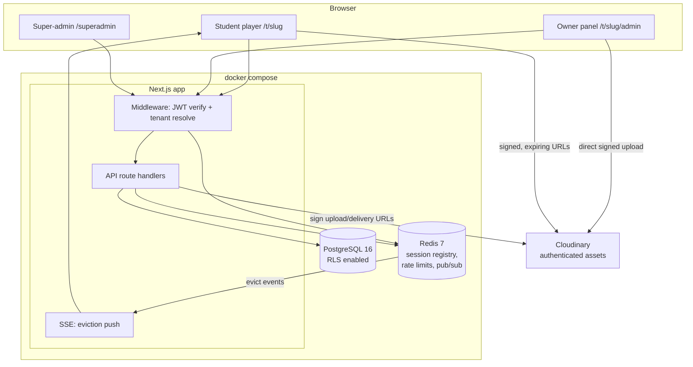

# Kursim — Multi-Tenant Course Platform: Architecture

> Status: **IMPLEMENTED** — MVP built and verified end-to-end (see README for run instructions).

## 1. Stack (recommendation + justification)

**Next.js 15 (App Router, TypeScript, standalone output) · PostgreSQL 16 + Prisma · Redis 7 · Cloudinary · Docker Compose.**

One framework serves the student player, owner panel, super-admin panel, and the API (route handlers), which minimizes moving parts for a self-hosted `docker compose up` and gives us end-to-end TypeScript. Prisma provides a typed schema, migrations, and — critically — **client extensions** that let us inject `tenant_id` scoping into every query automatically, backed by Postgres **row-level security** as a second, independent isolation layer. Redis is the natural home for the anti-sharing feature: per-user session sets with TTLs give O(1) "is this session still alive?" checks on every request, and keyspace pub/sub delivers instant eviction. We deliberately **do not use NextAuth**: the session registry (jti validation, block-vs-evict, instant kill) *is* the product's key feature, and owning the auth code with `jose` + `argon2` is safer than fighting an abstraction that hides exactly the lifecycle we need to control. Cloudinary is the only external service (per spec); everything else runs locally.

Supporting choices: **zod** (validation at every API boundary), **argon2id** (password hashing), **rate limiting** via Redis fixed-window on auth endpoints, **Tailwind CSS with logical properties** (RTL-correct Hebrew UI), **Vitest** for the auth/session test suite.

## 2. System diagram



## 3. Multi-tenancy & isolation (defense in depth — two independent layers)

- **URL scheme**: path-based — `/t/{tenantSlug}/...` (student), `/t/{tenantSlug}/admin/...` (owner/instructor), `/superadmin/...` (platform). No wildcard DNS/TLS needed; subdomains are a v1 add-on.
- **Layer 1 — Prisma client extension**: every request obtains a tenant-scoped Prisma client. The extension injects `where: { tenantId }` into every read and `data: { tenantId }` into every create for all tenant-owned models. Application code *cannot forget* the filter because it never sees the raw client.
- **Layer 2 — Postgres RLS**: all tenant-owned tables get `ENABLE ROW LEVEL SECURITY` with policy `tenant_id = current_setting('app.tenant_id')::uuid`. The scoped client runs `SET LOCAL app.tenant_id` per transaction. Even a bug in layer 1 returns zero rows, not another tenant's rows. The app connects as a **non-superuser role** so RLS actually applies.
- **Cross-checks**: JWT carries `tenantId`; middleware verifies it matches the `{tenantSlug}` in the URL (403 on mismatch). Super-admin uses a separate, non-tenant-scoped code path that never touches tenant UI routes.

## 4. Auth & the 3-session limiter (the key feature)

### Tokens
| Token | Form | Lifetime | Storage |
|---|---|---|---|
| Access | JWT (jose, HS256) — claims: `sub`, `tenantId`, `role`, `sid`, `jti` | 10 min | httpOnly cookie |
| Refresh | Opaque 256-bit random, **rotated on every use** | 30 days sliding | httpOnly cookie; argon2 hash kept in Redis session |

### Redis session registry
```
sess:{sid}            HASH  { userId, tenantId, deviceLabel, ua, ip, createdAt, lastSeenAt, refreshHash }  TTL 30d, refreshed on activity
user_sessions:{uid}   ZSET  member=sid, score=lastSeenAt   (oldest session = lowest score)
ratelimit:*           fixed-window counters for login/refresh endpoints
channel evict:{sid}   pub/sub for instant push to the evicted client
```

### Lifecycle
1. **Login**: rate-limit check → argon2 verify → count live members of `user_sessions:{uid}` (pruning dead sids):
   - under limit (tenant-configurable, default **3**) → create session;
   - at limit + policy `BLOCK` → **401 with "device limit reached"** listing active devices;
   - at limit + policy `EVICT_OLDEST` → delete lowest-score session, publish `evict:{sid}`, then create the new one.
2. **Every request** (middleware): verify JWT signature/expiry **and** `EXISTS sess:{sid}`. Session gone → **401 instantly**, cookies cleared. This is what makes eviction/kick take effect immediately despite the JWT still being cryptographically valid.
3. **Refresh**: constant-time compare against `refreshHash`; reuse of a rotated token ⇒ token theft assumed ⇒ kill that session.
4. **Eviction push**: player holds an SSE connection subscribed to `evict:{sid}`; evicted device shows "הופעל ממכשיר אחר" and redirects to login. Even with SSE down, the next request 401s.
5. **Heartbeat**: player pings every 30 s → updates `lastSeenAt` (drives "who's watching now" analytics and the oldest-session ordering).
6. **Session = browser/device**: `sid` lives in the cookie, so tabs share one session; a second browser or device is a second session.
7. **Admin controls**: owner can view a student's live sessions and kill any of them; suspend/reset/delete student kills all sessions atomically.

## 5. Cloudinary flow

- **Storage layout**: `tenants/{tenantId}/courses/{courseId}/…`, all assets `type: authenticated` (unsigned URLs simply don't resolve).
- **Upload (large videos)**: owner panel asks the API for a signed upload signature (API validates role + course ownership, pins the folder & `type: authenticated`) → browser uploads **directly to Cloudinary** (chunked, so multi-GB videos never pass through our server) → on success the client posts `{public_id, duration, bytes}` back and the API persists it to the Lesson after verifying the public_id lies inside the tenant's folder prefix.
- **Playback/download**: player requests a URL from the API → API checks: valid session (Redis) + enrollment + tenant match → returns a **signed, time-limited URL** (video ≈ 4 h to survive a viewing session; documents/images ≈ 15 min). Shared links die on expiry, and a kicked session can't mint new ones.
- **Deletion**: removing a lesson/course/tenant queues Cloudinary destroy calls for its prefix.

## 6. Data model (ERD)

```mermaid
erDiagram
    Tenant ||--o{ User : has
    Tenant ||--o{ Course : owns
    Tenant ||--o{ Invite : issues
    Course ||--o{ Module : contains
    Module ||--o{ Lesson : contains
    Lesson ||--o{ Attachment : has
    Course ||--o{ Enrollment : "enrolled via"
    User   ||--o{ Enrollment : "student in"
    User   ||--o{ Progress : tracks
    Lesson ||--o{ Progress : "progress on"

    Tenant { uuid id PK; string slug UK; string name; enum status "ACTIVE|SUSPENDED"; int sessionLimit "default 3"; enum evictionPolicy "BLOCK|EVICT_OLDEST" }
    User { uuid id PK; uuid tenantId FK "NULL only for SUPER_ADMIN"; string email; string passwordHash; enum role "SUPER_ADMIN|OWNER|INSTRUCTOR|STUDENT"; enum status; bool mustChangePassword; datetime lastLoginAt }
    Invite { uuid id PK; uuid tenantId FK; string tokenHash UK; string email "optional"; enum role; datetime expiresAt; datetime usedAt }
    Course { uuid id PK; uuid tenantId FK; string title; text description; string coverPublicId; enum status "DRAFT|PUBLISHED" }
    Module { uuid id PK; uuid tenantId FK; uuid courseId FK; string title; int sortOrder }
    Lesson { uuid id PK; uuid tenantId FK; uuid moduleId FK; string title; text notes; string videoPublicId; int durationSec; int sortOrder }
    Attachment { uuid id PK; uuid tenantId FK; uuid lessonId FK; string publicId; string filename; enum kind "DOC|IMAGE|OTHER" }
    Enrollment { uuid id PK; uuid tenantId FK; uuid studentId FK; uuid courseId FK; datetime createdAt }
    Progress { uuid id PK; uuid tenantId FK; uuid studentId FK; uuid lessonId FK; int lastPositionSec; datetime completedAt }
```

Notes: `email` unique **per tenant** (`@@unique([tenantId, email])`) — the same person may be a student of two owners. Every tenant-owned table carries a denormalized `tenantId` so RLS applies uniformly. **Live sessions exist only in Redis** (source of truth for the limiter); a `SessionLog` history table is v1, not MVP.

## 7. Roles

| Role | Scope | Can |
|---|---|---|
| SUPER_ADMIN | platform | CRUD tenants, suspend tenants, usage overview; no access to tenant content UI |
| OWNER | tenant | everything in-tenant: courses, media, students, instructors, session policy, analytics |
| INSTRUCTOR | tenant | course/module/lesson content CRUD, media upload; no student credential management, no policy |
| STUDENT | tenant | view enrolled courses, watch, track own progress |

## 8. Locale

Hebrew, RTL-only: `<html dir="rtl" lang="he">`, Tailwind **logical properties** (`ms-*`/`me-*`, `start`/`end`) throughout, all strings in a single `lib/he.ts` dictionary (one file ⇒ i18n retrofit later is mechanical, not archaeological).

## 9. Folder structure

```
kursim/
├── docker-compose.yml            # app + postgres + redis, one command up
├── Dockerfile                    # multi-stage, standalone Next.js
├── .env.example                  # every var documented, no secrets in repo
├── prisma/schema.prisma          # + migrations/ (incl. RLS SQL) + seed.ts
├── src/
│   ├── middleware.ts             # JWT verify, session-liveness, tenant resolve
│   ├── app/
│   │   ├── (auth)/login, invite/[token]/
│   │   ├── t/[slug]/             # student: courses, lesson player (SSE + heartbeat)
│   │   ├── t/[slug]/admin/       # owner: courses, students, sessions, analytics, settings
│   │   ├── superadmin/
│   │   └── api/                  # auth/, tenants/, courses/, students/, media/, sessions/, progress/
│   ├── lib/
│   │   ├── auth/                 # jwt.ts, password.ts, guards.ts
│   │   ├── session-registry/     # registry.ts (create/validate/evict/list), policy.ts, heartbeat.ts
│   │   ├── tenant/               # scoped-prisma.ts (client extension + RLS SET), resolve.ts
│   │   ├── cloudinary/           # sign-upload.ts, sign-delivery.ts
│   │   ├── rate-limit.ts, validation/ (zod), he.ts
│   └── components/
└── tests/                        # auth.test.ts, session-limiter.test.ts, tenant-isolation.test.ts
```

## 10. Phased plan & model delegation

| Phase | Scope | Model | Why |
|---|---|---|---|
| **0. Scaffold** | Next.js + Docker Compose + Prisma schema/migrations/RLS + seed (platform super-admin) + .env.example | **Haiku / fast** | Mechanical, well-trodden boilerplate |
| **1. Security core** | argon2 auth, JWT+refresh rotation, Redis session registry, **3-session limiter (BLOCK/EVICT)**, instant invalidation + SSE push, tenant-scoped Prisma + RLS, rate limiting, **tests for all of it** | **Opus / strongest** | Security-critical; a subtle bug here defeats the product's reason to exist |
| **2. Features** | Course→module→lesson CRUD, Cloudinary signed upload + signed playback, student player with heartbeat, owner student-management (create/suspend/reset/delete, invite links), session policy settings | **Sonnet / mid** | Standard feature logic on top of the hardened core |
| **3. Panels & polish** | Owner analytics (progress, live sessions, who's watching), super-admin tenant panel, remaining CRUD UI, docs/README | **Haiku / fast** | CRUD screens, tables, docs |
| **MVP exit criteria** | `docker compose up` → owner logs in → creates course + uploads video → student logs in on 4 devices → 4th is blocked/evicts oldest per policy → student watches via signed URL → owner sees live sessions | — | — |
| **v1 (later)** | Engagement analytics (watch time, drop-off), SMTP email invites, subdomains, English i18n, SessionLog history, audit log, watermark overlay | mixed | — |

## 11. Security checklist (MVP-blocking)

argon2id hashing · httpOnly/SameSite=Lax/Secure cookies · refresh rotation with reuse detection · rate limits on login/refresh/invite · zod on every API input · RLS + scoped client · signed expiring media URLs, `type: authenticated` · invite tokens stored hashed, single-use, expiring · no secrets in repo (.env.example only) · non-root Docker user · suspend tenant ⇒ all its users' sessions killed.
